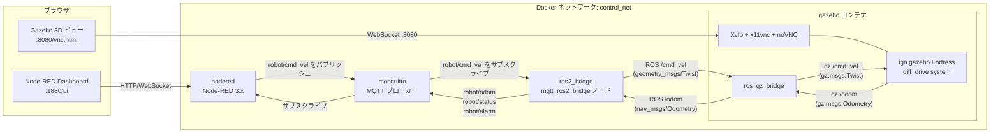
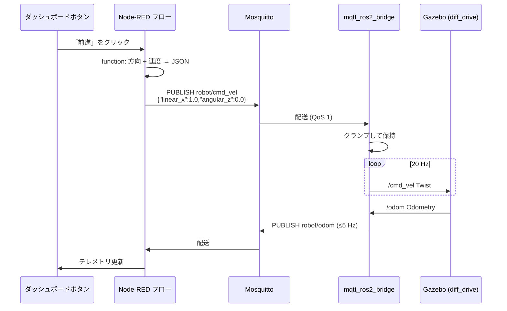

# システムアーキテクチャ

## 1. 目的

参考リポジトリ `gazebo-keyboard-control` の `keyboard_input → control_logic → gazebo`
という構成を、**Node-RED Dashboard** から **MQTT** 経由で同じ Gazebo
ロボットを操作するデモへリファクタリングします。
MQTT のトピック設計を唯一の安定した制御インターフェースとして固定する
ことで、将来 Node-RED Dashboard を SoftPLC に置き換えても ROS 2 側に手を
入れる必要はありません。

## 2. コンテナ構成図

* **単一の制御インターフェース** — 経路上の登場人物は MQTT か ROS 2 の
  どちらかしか話しません。MQTT のトピック設計が公開された契約です。
* **`control_logic` コンテナを廃止** — クランプ・ウォッチドッグ・指令
  整形はすべてブリッジノード内に集約し、稼働コンポーネントを 1 つ減らしました。
* **Gazebo は Fortress (Gazebo Sim 6.x)** — `ign gazebo` を `Xvfb` 仮想
  ディスプレイに描画し、`x11vnc` + `noVNC` でブラウザに WebSocket 配信
  します。ホスト側に XQuartz / VcXsrv は不要です。ROS 2 Humble での
  公式バイナリペアは Fortress までで、Harmonic を使う場合は ros_gz の
  ソースビルドが必要になります。
* **gz transport は `ros_gz_bridge` で ROS 2 と相互変換** — MQTT 層から
  見える契約は ROS トピック (`/cmd_vel`, `/odom`) のままで、Gazebo の
  内部トピックは隠蔽されます。
* **DDS は Docker 内に閉じ込め** — `gazebo` と `ros2_bridge` は同じ
  `ROS_DOMAIN_ID` と `control_net` ブリッジネットワークを共有します。
  外部からは MQTT しか見えません。

## 3. データフロー

ブリッジには 2 つの安全機構を組み込んでいます。

* **ウォッチドッグ。** `WATCHDOG_SEC`（既定 1.0 秒）以内に指令が届かな
  ければ `(0, 0)` を `/cmd_vel` に流し続け、`WATCHDOG_TIMEOUT` アラーム
  を発行します。指令再開時には `WATCHDOG_CLEAR` を発行します。
* **ステータス LWT。** `robot/status` は MQTT の retained メッセージ
  です。正常接続時に `{"state":"online"}` を発行し、ブリッジが異常終了
  した場合はブローカーが Last Will として `{"state":"offline"}` を発行
  します。ダッシュボードや将来の SoftPLC はこの値だけを見ればブリッジ
  健全性を判定できます。

## 4. 設定項目

調整値はすべて `ros2_bridge` サービスの環境変数で公開しています
（`docker-compose.yml` 参照）。

| 環境変数 | 既定値 | 意味 |
|---|---|---|
| `MQTT_HOST` / `MQTT_PORT` | `mosquitto` / `1883` | ブローカーアドレス |
| `MQTT_CMD_TOPIC` | `robot/cmd_vel` | 指令受信トピック |
| `MQTT_STATUS_TOPIC` | `robot/status` | retained のオンライン状態 |
| `MQTT_ODOM_TOPIC` | `robot/odom` | テレメトリ送信トピック |
| `MQTT_ALARM_TOPIC` | `robot/alarm` | アラーム送信トピック |
| `ROS_CMD_VEL_TOPIC` | `/cmd_vel` | ROS パブリッシャ |
| `ROS_ODOM_TOPIC` | `/odom` | ROS サブスクライバ |
| `WATCHDOG_SEC` | `1.0` | この秒数を超えて指令が無い場合ゼロ化 |
| `MAX_LINEAR` / `MAX_ANGULAR` | `2.0` / `2.0` | クランプ上限 (m/s, rad/s) |
| `PUBLISH_HZ` | `20.0` | `/cmd_vel` 再送周波数 |
| `ODOM_THROTTLE_HZ` | `5.0` | MQTT odom の上限頻度 |

## 5. SoftPLC への将来対応

ダッシュボードはあくまで MQTT クライアントの 1 つにすぎず、ROS 2 側は
Node-RED の存在を知りません。SoftPLC（Codesys、OpenPLC、MQTT ランタイム
付きの TwinCAT、Siemens の IoTSink など）は次の手順で差し替えられます。

1. 同じネットワーク上の同じブローカーに接続する。
2. `robot/cmd_vel` に同じ JSON を発行する。
3. `robot/status` / `robot/odom` / `robot/alarm` をサブスクライブする。

段階的な計画は `docs/softplc-migration.md` を参照してください。
