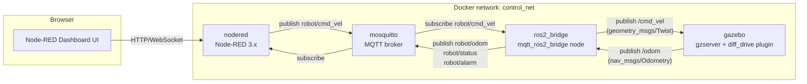
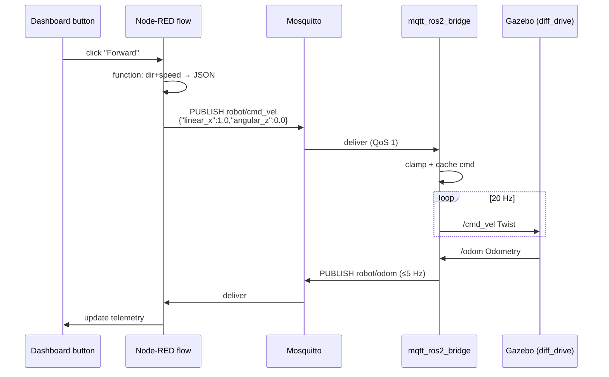

# System Architecture

## 1. Goal

Replace the original `keyboard_input → control_logic → gazebo` PoC with a
demonstrator that drives the same Gazebo robot from a **Node-RED
Dashboard** through **MQTT**. The MQTT topic surface is the single,
stable control interface, so the dashboard can later be swapped for a
SoftPLC without touching the ROS 2 side.

## 2. Container topology

* **Single control interface** — every actor in the chain only speaks
  MQTT or ROS 2. The MQTT topic surface is the contract.
* **No `control_logic` container** — clamping, watchdog, and command
  shaping live inside the bridge node so there is one less moving part.
* **DDS stays inside Docker** — `gazebo` and `ros2_bridge` share the
  `ROS_DOMAIN_ID` and the `control_net` bridge network; the rest of the
  world only sees MQTT.

## 3. Data flow

Two safety features live in the bridge:

* **Watchdog.** If no command arrives within `WATCHDOG_SEC` (default
  `1.0`), the bridge republishes `(0, 0)` on `/cmd_vel` and emits a
  `WATCHDOG_TIMEOUT` alarm. A `WATCHDOG_CLEAR` alarm is emitted once
  commands resume.
* **Status LWT.** `robot/status` is a retained MQTT topic. On healthy
  connect the bridge publishes `{"state":"online"}`; the broker
  publishes `{"state":"offline"}` as the Last Will if the bridge
  crashes. Dashboards (and future SoftPLCs) can rely on this signal.

## 4. Configuration surface

All tunables are environment variables on the `ros2_bridge` service
(see `docker-compose.yml`):

| Var | Default | Meaning |
|---|---|---|
| `MQTT_HOST` / `MQTT_PORT` | `mosquitto` / `1883` | broker address |
| `MQTT_CMD_TOPIC` | `robot/cmd_vel` | inbound command topic |
| `MQTT_STATUS_TOPIC` | `robot/status` | retained online/offline |
| `MQTT_ODOM_TOPIC` | `robot/odom` | outbound telemetry |
| `MQTT_ALARM_TOPIC` | `robot/alarm` | outbound alarms |
| `ROS_CMD_VEL_TOPIC` | `/cmd_vel` | ROS publisher |
| `ROS_ODOM_TOPIC` | `/odom` | ROS subscriber |
| `WATCHDOG_SEC` | `1.0` | zero out cmd after this many seconds idle |
| `MAX_LINEAR` / `MAX_ANGULAR` | `2.0` / `2.0` | clamp limits (m/s, rad/s) |
| `PUBLISH_HZ` | `20.0` | /cmd_vel republish rate |
| `ODOM_THROTTLE_HZ` | `5.0` | MQTT odom rate cap |

## 5. Future-proofing for SoftPLC

The dashboard is one MQTT client; nothing on the ROS 2 side knows or
cares about Node-RED. A SoftPLC (Codesys, OpenPLC, Beckhoff TwinCAT
with an MQTT runtime, Siemens with `IoTSink`, …) drops in by:

1. Connecting to the same broker on the same network.
2. Publishing `robot/cmd_vel` with the same JSON payload.
3. Subscribing to `robot/status`, `robot/odom`, `robot/alarm`.

See `docs/softplc-migration.md` for the staged plan.
