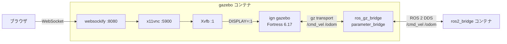
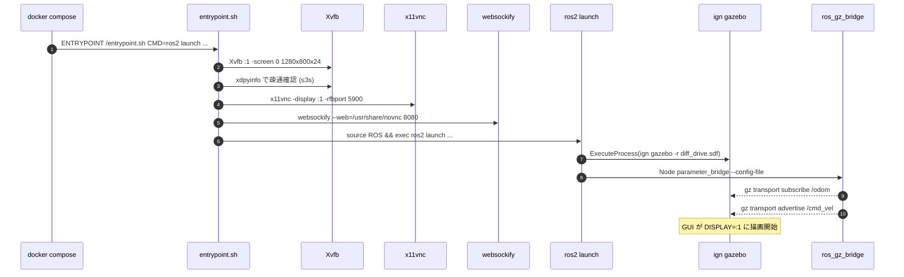
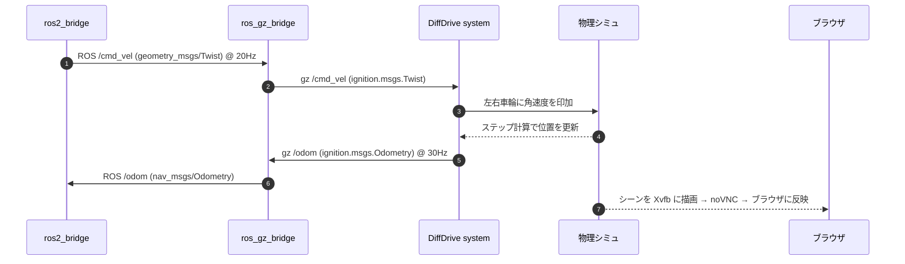
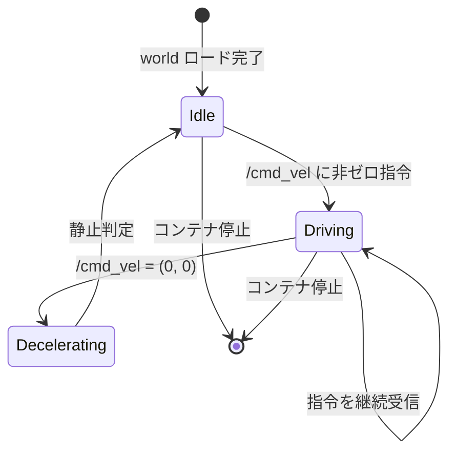
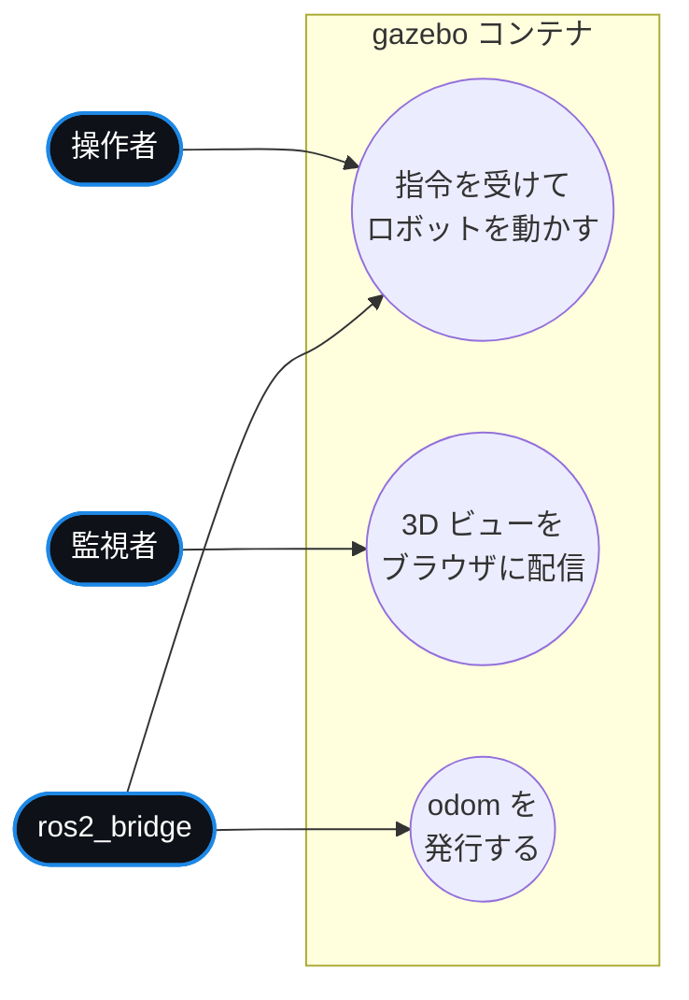

# gazebo コンテナ

ROS 2 Humble + **Gazebo Fortress (Gazebo Sim 6.x)** + `ros_gz_bridge` を
1 コンテナで起動し、3D ビューを **noVNC でブラウザ配信**する。
MQTT は一切扱わず、外部とは ROS 2 の `/cmd_vel` と `/odom` のみで会話する。

## 役割

| 担当 | 説明 |
|---|---|
| ロボットシミュレーション | SDF で定義した差動駆動ロボットを DART 物理エンジンで実行 |
| gz transport ↔ ROS 2 翻訳 | `ros_gz_bridge` が `/cmd_vel` と `/odom` を双方向にマップ |
| 3D ビューのブラウザ配信 | Xvfb 仮想ディスプレイ + x11vnc + noVNC websockify |

## ファイル構成

| ファイル | 役割 |
|---|---|
| `Dockerfile` | OSRF apt から `ignition-fortress` / `ros-humble-ros-gz` と Xvfb / x11vnc / noVNC を導入 |
| `entrypoint.sh` | Xvfb (:1) → x11vnc (:5900) → websockify (:8080) を順に起動して CMD を `exec` |
| `launch/gazebo.launch.py` | `ign gazebo -r ...` と `ros_gz_bridge parameter_bridge` を起動 |
| `worlds/diff_drive.sdf` | SDF 1.9 — 地面 / 光源 / 差動駆動ロボット + `ignition::gazebo::systems::DiffDrive` |
| `config/ros_gz_bridge.yaml` | `/cmd_vel`（Twist）と `/odom`（Odometry）を双方向にマップ |

## コンポーネント図



## シーケンス図 — 起動



## シーケンス図 — ランタイム（指令と odom）



## アクティビティ図 — `entrypoint.sh`

```mermaid
flowchart TD
    A([開始]) --> B[Xvfb :1 をバックグラウンド起動]
    B --> C{xdpyinfo で<br/>X 疎通 OK?}
    C -- "成功" --> D
    C -- "3 秒経過<br/>でも続行" --> D[x11vnc を起動]
    D --> E[websockify 起動]
    E --> F[/opt/ros/humble/setup.bash を source]
    F --> G["exec ""$@"" で CMD を前景化"]
    G --> H([CMD の終了で終了])
```

## 状態遷移図 — 差動駆動ロボットの動作状態



## ユースケース図



## 公開インターフェース

| インターフェース | 方向 | 内容 |
|---|---|---|
| ホスト `:8080` (HTTP/WebSocket) | in  | noVNC ビューアー (`/vnc.html`) |
| ROS 2 `/cmd_vel` (`geometry_msgs/Twist`) | in  | 速度指令 |
| ROS 2 `/odom` (`nav_msgs/Odometry`) | out | 走行オドメトリ |

## 環境変数

| 変数 | 既定値 | 用途 |
|---|---|---|
| `ROS_DOMAIN_ID` | `42` | ros2_bridge と同一にする |
| `RMW_IMPLEMENTATION` | `rmw_cyclonedds_cpp` | DDS 実装 |
| `DISPLAY` | `:1` | Xvfb の表示先 |
| `LIBGL_ALWAYS_SOFTWARE` | `1` | ソフトウェア OpenGL (llvmpipe) |
| `OGRE_RTT_MODE` | `Copy` | Xvfb 環境向けの OGRE2 設定 |
| `XVFB_RESOLUTION` | `1280x800x24` | 仮想ディスプレイ解像度 |

## トラブルシューティング

| 症状 | 原因 / 対処 |
|---|---|
| 3D ビューが真っ黒 | OGRE2 + llvmpipe の初期化に 10〜20 秒かかる。マウスをドラッグして強制再描画 |
| Anti-aliasing warning | 無害。FSAA=0 にフォールバック |
| `Loading world file [/sim/worlds/diff_drive.world]` | 古いイメージ。`docker compose build --no-cache gazebo` |
| `platform (linux/amd64) does not match host (linux/arm64)` | 古い amd64 イメージが残存。同上 |
