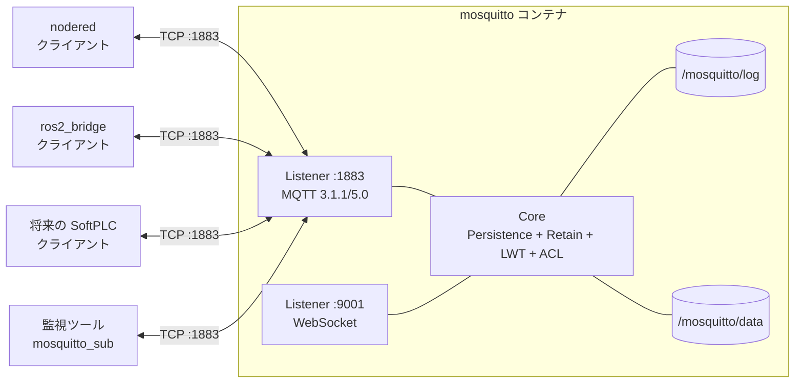
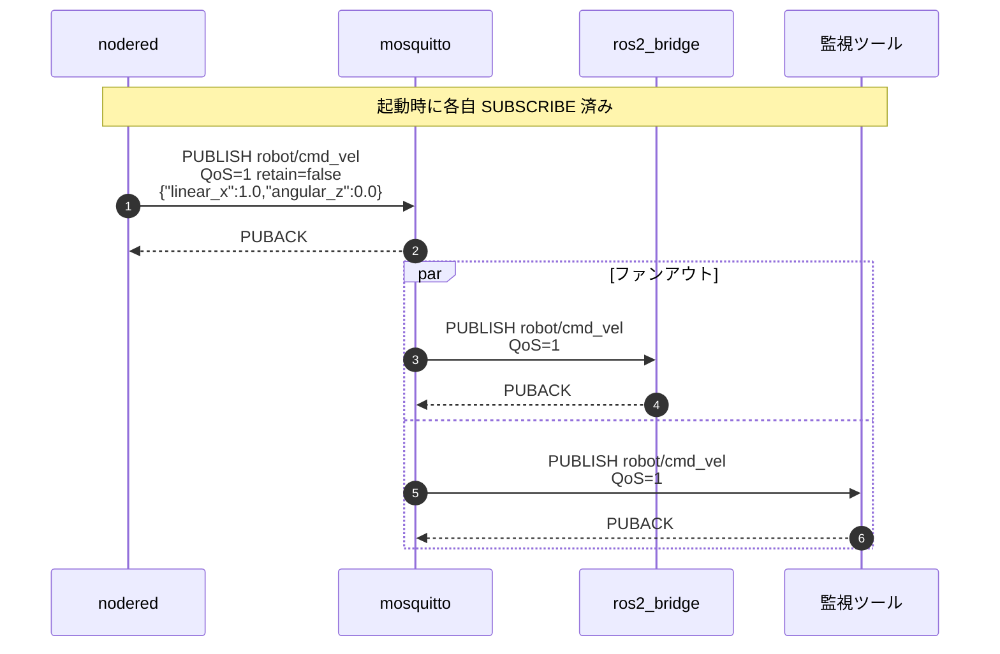
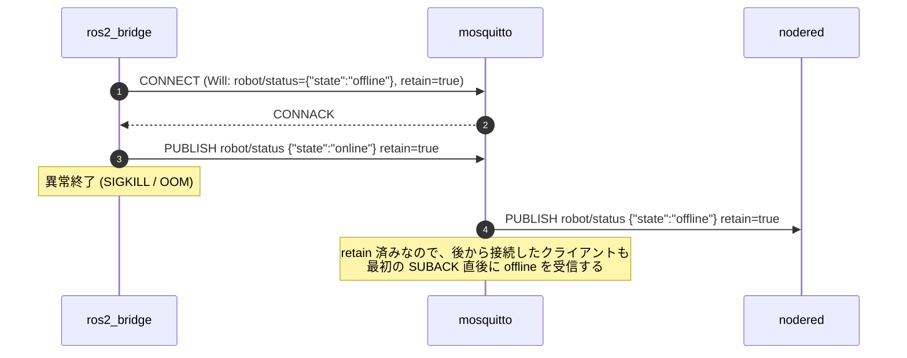
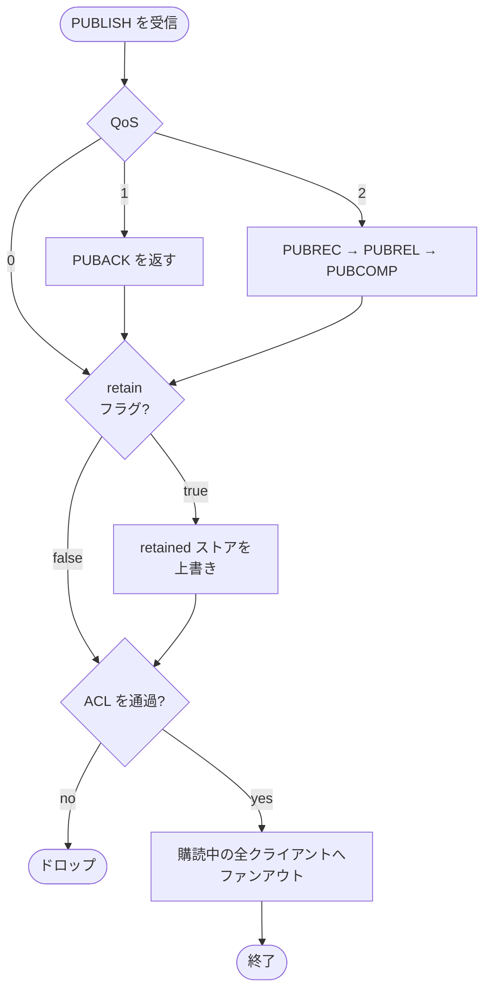
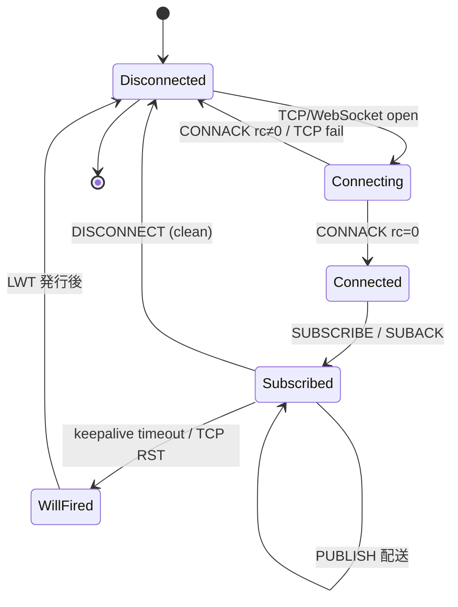
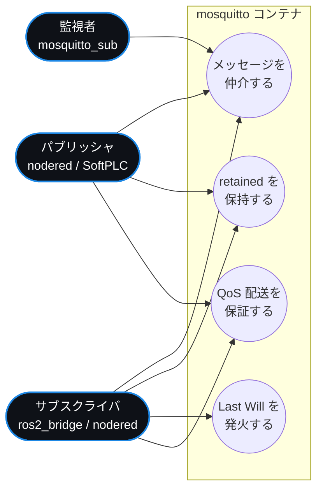

# mosquitto コンテナ

Eclipse Mosquitto 2.x を使った **MQTT 3.1.1 / 5.0 ブローカー**。
本デモにおける唯一の「公開された制御インターフェース境界」で、ここに
集まる `robot/*` トピックが Node-RED と ROS 2 ブリッジ（および将来の
SoftPLC）の契約点となる。

## 役割

| 担当 | 説明 |
|---|---|
| メッセージ仲介 | パブリッシュ → 同じトピックを購読中の全クライアントへ配送 |
| QoS 保証 | QoS 0 / 1 / 2 を扱う。本デモは指令とアラームに QoS 1 を採用 |
| Retained メッセージ保持 | `robot/status` を retained で保存し後発の購読者へ即配送 |
| Last Will (LWT) | ros2_bridge の異常終了時に `robot/status: offline` を自動発行 |
| WebSocket 配信 | `:9001` で MQTT-over-WebSocket。ブラウザ MQTT クライアントから接続可能 |

## ファイル構成

| ファイル | 役割 |
|---|---|
| `config/mosquitto.conf` | リスナー 2 系統 (1883/TCP, 9001/WS)、永続化、ログ設定 |

本コンテナは公式イメージ `eclipse-mosquitto:2` をそのまま利用するので
`Dockerfile` を持たない（`docker-compose.yml` で直接指定）。

## コンポーネント図

## シーケンス図 — パブリッシュ → ファンアウト

## シーケンス図 — Last Will（ブリッジ異常終了）

## アクティビティ図 — メッセージ受信処理

## 状態遷移図 — クライアント 1 接続のライフサイクル

## ユースケース図

## 公開インターフェース

| インターフェース | プロトコル | 用途 |
|---|---|---|
| ホスト `:1883` | MQTT 3.1.1 / 5.0 over TCP | 通常のクライアント接続 |
| ホスト `:9001` | MQTT over WebSocket | ブラウザクライアント |

## トピック契約

詳細は [`docs/mqtt-spec.md`](../docs/mqtt-spec.md) と
[`docs/topics.md`](../docs/topics.md) を参照。
本コンテナはトピック名を意識しない（任意の `robot/*` を扱う）。

## 設定の主要項目（`config/mosquitto.conf`）

| 設定 | 値 | 意味 |
|---|---|---|
| `listener` | `1883` / `9001 protocol websockets` | 2 リスナー |
| `allow_anonymous` | `true` | デモのため匿名許可。本番では `password_file` + ACL |
| `persistence` | `true` | retained と QoS 1+ の永続化 |
| `persistence_location` | `/mosquitto/data/` | 永続化先（Docker volume） |
| `log_dest` | `stdout` + `file` | `docker compose logs mosquitto` で確認可能 |

## 永続化ボリューム

| ボリューム名 | マウント先 | 内容 |
|---|---|---|
| `mosquitto_data` | `/mosquitto/data` | retained, QoS 1+ の queued messages |
| `mosquitto_log` | `/mosquitto/log` | サーバーログ |

## トラブルシューティング

| 症状 | 対処 |
|---|---|
| `docker compose logs mosquitto` で `Connection from .. refused` | 認証や ACL を有効化した直後に多い。設定ファイルを確認 |
| Node-RED から接続できない | broker ホスト名は **`mosquitto`**（Compose のサービス名）。`localhost` ではない |
| `robot/status` が `offline` のまま戻らない | ros2_bridge 側の問題。`docker compose logs ros2_bridge` を確認 |
| retained が消えない | ボリュームに残るのが仕様。空 retained を送ると消える: `mosquitto_pub -t robot/status -m '' -r` |
