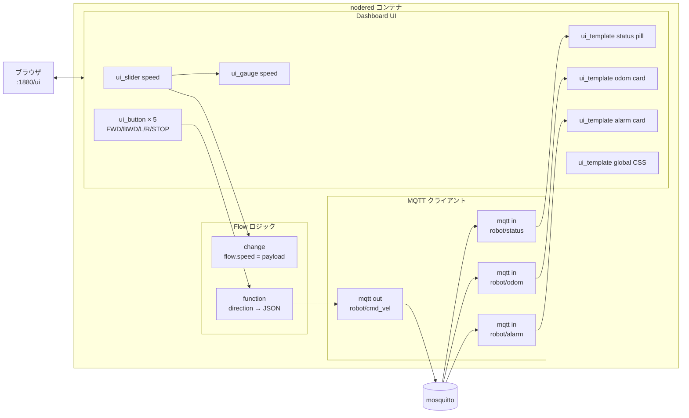
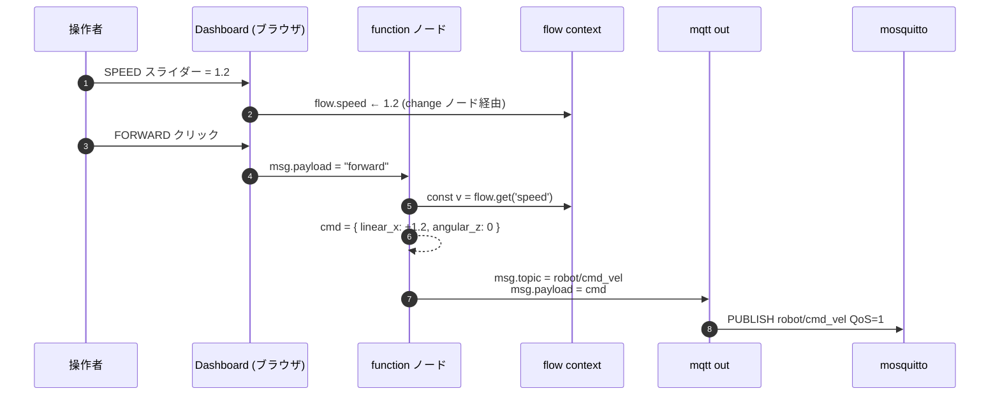
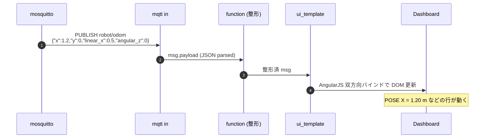
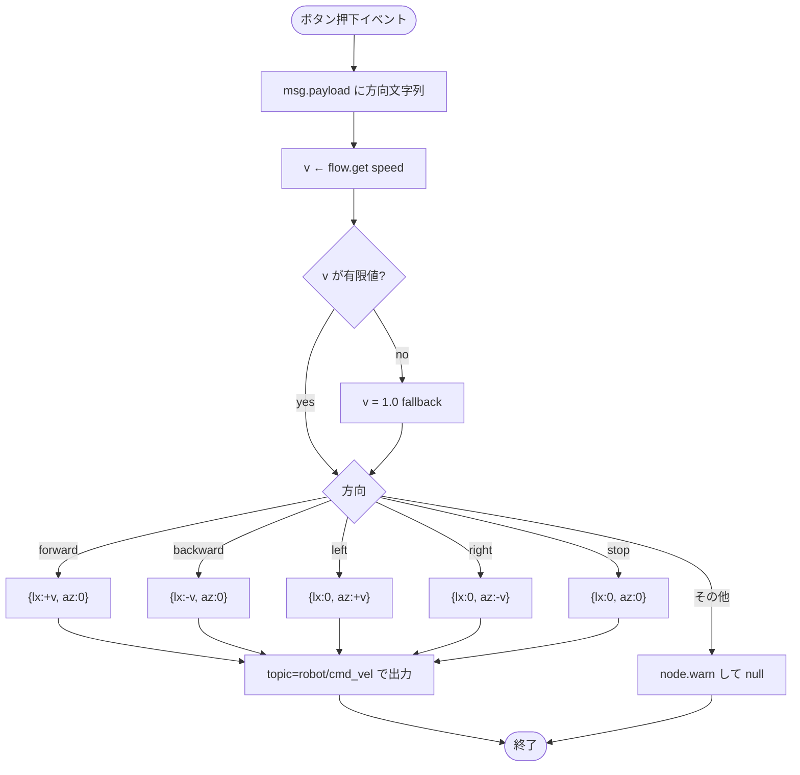
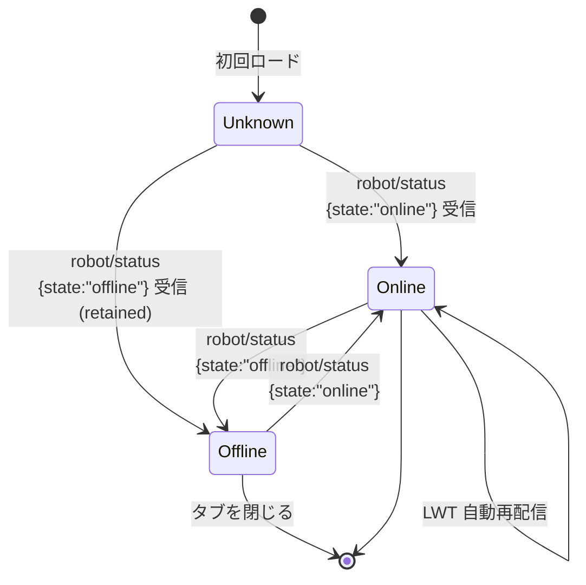
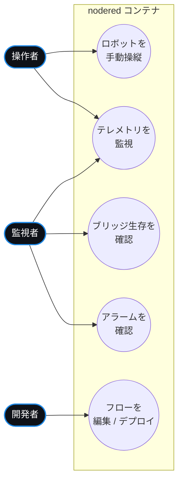

# nodered コンテナ

Node-RED 3.x + `node-red-dashboard` で構築した**手動オペレータ UI**。
方向ボタンとスライダーから JSON 速度指令を作って `robot/cmd_vel` に
発行し、`robot/status` / `robot/odom` / `robot/alarm` を購読して
リアルタイム表示する。

> 将来この UI は SoftPLC に置き換える。MQTT 契約は同じなので、
> 置換時に ROS 2 / Gazebo 側に手を入れる必要は無い。

## 役割

| 担当 | 説明 |
|---|---|
| オペレータ UI | DRIVE / SPEED / TELEMETRY の 3 パネルをブラウザに配信 |
| 指令生成 | ボタン押下 + 速度スライダー → JSON ペイロードを組み立て |
| MQTT 発行 | `robot/cmd_vel` を QoS 1 で発行 |
| テレメトリ表示 | `robot/status` のバッジ脈動、`robot/odom` の数値表、`robot/alarm` のカード |

## ファイル構成

| ファイル | 役割 |
|---|---|
| `Dockerfile` | 公式 `nodered/node-red:3.1` に `node-red-dashboard@3.6.5` を追加 |
| `flows.json` | インポート可能なフロー定義。`docker-compose.yml` でコンテナの `/data` に bind mount |

## コンポーネント図

## シーケンス図 — ボタン押下から MQTT 発行まで

## シーケンス図 — テレメトリ受信から表示更新

## アクティビティ図 — 方向決定ロジック

## 状態遷移図 — BRIDGE バッジ表示

## ユースケース図

## 公開インターフェース

| インターフェース | 方向 | 内容 |
|---|---|---|
| ホスト `:1880` | in | Node-RED エディタ（フロー編集） |
| ホスト `:1880/ui` | in | Dashboard（操作 UI） |
| MQTT `robot/cmd_vel` (Pub QoS=1) | out | 指令 |
| MQTT `robot/status` (Sub QoS=1, retained) | in | ブリッジ生存 |
| MQTT `robot/odom` (Sub QoS=0) | in | テレメトリ |
| MQTT `robot/alarm` (Sub QoS=1) | in | アラーム |

## ノード一覧（flows.json）

| ID | タイプ | 役割 |
|---|---|---|
| `uiBase` | `ui_base` | ダークテーマ + サイト名 |
| `cssInject` | `ui_template (global)` | グローバル CSS（バッジ脈動、カード装飾、ボタン陰影） |
| `btnForward`〜`btnBackward` | `ui_button` × 5 | 方向ボタン。topic=`dir`, payload=方向文字列 |
| `fnCmd` | `function` | 方向 + flow.speed → cmd_vel JSON |
| `mqttOutCmd` | `mqtt out` | `robot/cmd_vel` 発行 |
| `sliderSpeed` | `ui_slider` | 0〜2 のスピード設定 |
| `setSpeed` | `change` | `flow.speed = msg.payload` |
| `gaugeSpeed` | `ui_gauge (wave)` | スライダー値のライブ表示 |
| `mqttInStatus` / `tplStatus` | `mqtt in` + `ui_template` | BRIDGE 脈動バッジ |
| `mqttInOdom` / `tplOdom` | 同上 | POSE X/Y, LIN.X, ANG.Z の 4 行表 |
| `mqttInAlarm` / `tplAlarm` | 同上 | LATEST ALARM カード（CLEAR 時は緑） |

## トラブルシューティング

| 症状 | 対処 |
|---|---|
| アイコンが `mi-arrow_upward` などの文字列で表示される | `node-red-dashboard` が未インストール。`docker compose build --no-cache nodered` |
| ボタンを押しても何も起きない | BRIDGE バッジが `OFFLINE`：`docker compose logs ros2_bridge`。`ONLINE`：MQTT トレースで PUBLISH の有無を確認 |
| ライブで編集した変更が保存されない | `docker-compose.yml` で `flows.json` を read-only でマウントしているため。`compose cp` で書き戻すか、bind mount を ro 解除する |
| スライダーを動かしても波形ゲージが反応しない | `sliderSpeed.passthru` が `false` だと出力されない。`true` のままにする |
