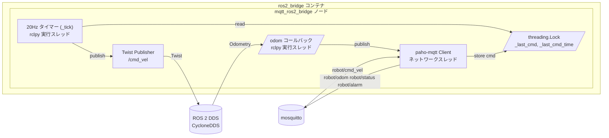
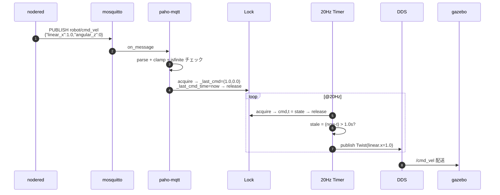
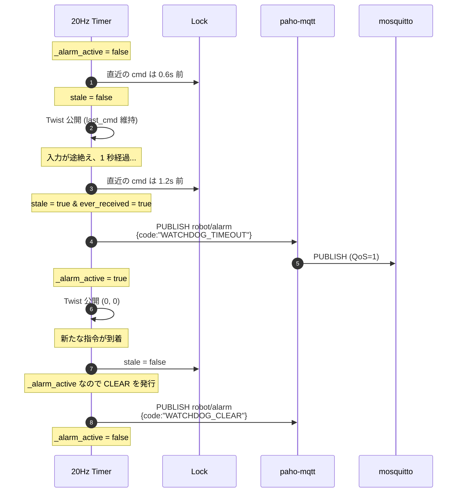
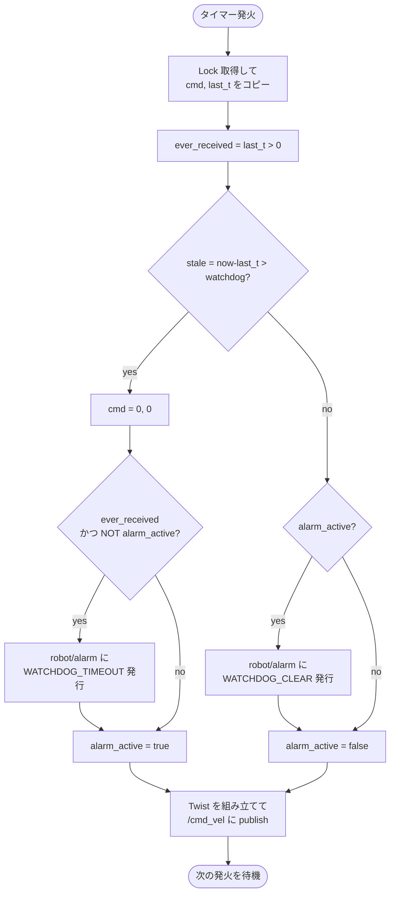
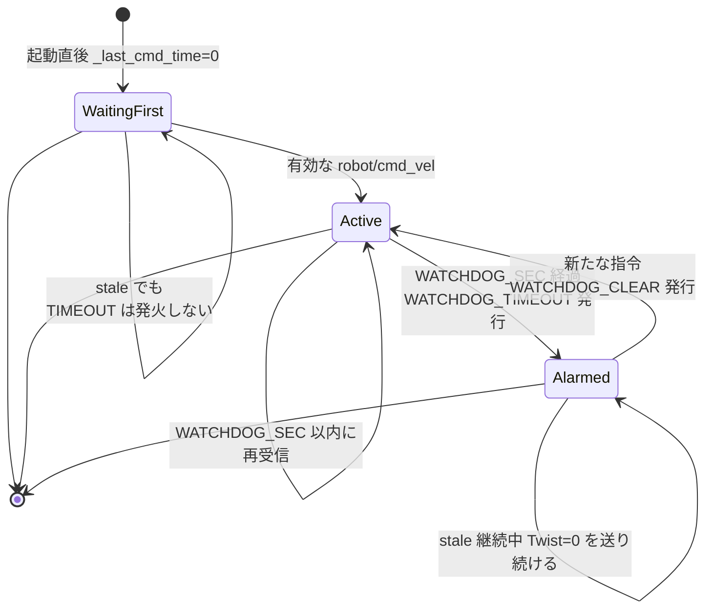
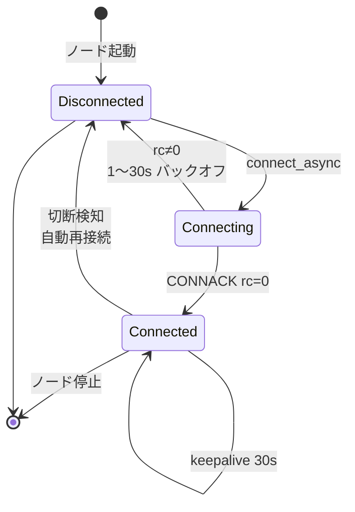
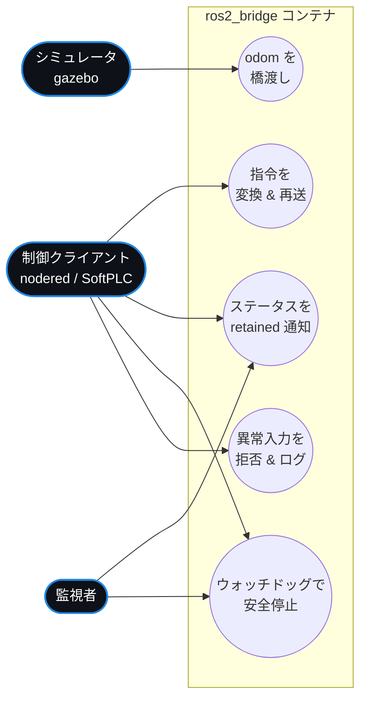

# ros2_bridge コンテナ

`mqtt_ros2_bridge` ROS 2 ノードを 1 個だけ動かすコンテナ。
MQTT 側（クライアントの世界）と ROS 2 側（シミュレータの世界）を翻訳し、
ウォッチドッグ・クランプ・retained ステータス・アラーム発行を担う。

**設計上の重要な性質:**
- MQTT 契約は不変（Node-RED でも SoftPLC でも同じ JSON で動く）
- ROS 2 契約も不変（Gazebo Classic でも Fortress でも `/cmd_vel` と `/odom`）
- このノードが「2 つの世界の唯一の境界」

## 役割

| 担当 | 説明 |
|---|---|
| MQTT → ROS 翻訳 | `robot/cmd_vel` JSON → `geometry_msgs/Twist` を `PUBLISH_HZ` で再送 |
| ROS → MQTT 翻訳 | `/odom` `nav_msgs/Odometry` → `robot/odom` JSON を `ODOM_THROTTLE_HZ` で間引いて発行 |
| クランプ | `±MAX_LINEAR` / `±MAX_ANGULAR` で速度を制限 |
| ウォッチドッグ | `WATCHDOG_SEC` 無入力でゼロ速度に強制 + `WATCHDOG_TIMEOUT` 発行 |
| ステータス通知 | 接続成功時に `robot/status: online` を retained、異常終了時は LWT が `offline` |
| ペイロード検証 | 非 JSON / 数値以外 / NaN・Inf をログとともに拒否 |

## ファイル構成

| ファイル | 役割 |
|---|---|
| `Dockerfile` | `ros:humble-ros-base` に `python3-paho-mqtt` と CycloneDDS を追加、ワークスペースをビルド |
| `entrypoint.sh` | `/opt/ros/humble/setup.bash` と `/ws/install/setup.bash` を source して CMD を `exec` |
| `ws/src/mqtt_ros2_bridge/` | ament_python の ROS 2 パッケージ |
| └ `mqtt_ros2_bridge/bridge_node.py` | 本体（200 行弱、依存は標準ライブラリ + rclpy + paho-mqtt） |
| └ `launch/bridge.launch.py` | `Node(bridge_node)` を起動するだけのランチャ |
| └ `package.xml`, `setup.py`, `setup.cfg` | パッケージメタ |

## コンポーネント図

## シーケンス図 — 通常時の指令往復

## シーケンス図 — ウォッチドッグ発火と解除

## アクティビティ図 — `_tick()`（20Hz 周期処理）

## 状態遷移図 — ウォッチドッグ

## 状態遷移図 — MQTT 接続

## ユースケース図

## 公開インターフェース

| インターフェース | 方向 | 内容 |
|---|---|---|
| MQTT `robot/cmd_vel` (Sub QoS=1) | in  | 指令 JSON |
| ROS 2 `/cmd_vel` (Pub) | out | `geometry_msgs/Twist` を 20Hz で再送 |
| ROS 2 `/odom` (Sub) | in  | `nav_msgs/Odometry` |
| MQTT `robot/status` (Pub QoS=1, retained, LWT) | out | `online`/`offline` |
| MQTT `robot/odom` (Pub QoS=0) | out | テレメトリ JSON |
| MQTT `robot/alarm` (Pub QoS=1) | out | `WATCHDOG_TIMEOUT` / `WATCHDOG_CLEAR` |

## 環境変数

| 変数 | 既定値 | 意味 |
|---|---|---|
| `MQTT_HOST` / `MQTT_PORT` | `mosquitto` / `1883` | ブローカー |
| `MQTT_CMD_TOPIC` | `robot/cmd_vel` | 指令受信トピック |
| `MQTT_STATUS_TOPIC` | `robot/status` | retained ステータス |
| `MQTT_ODOM_TOPIC` | `robot/odom` | テレメトリ送信 |
| `MQTT_ALARM_TOPIC` | `robot/alarm` | アラーム送信 |
| `ROS_CMD_VEL_TOPIC` | `/cmd_vel` | ROS パブリッシャ |
| `ROS_ODOM_TOPIC` | `/odom` | ROS サブスクライバ |
| `WATCHDOG_SEC` | `1.0` | 指令タイムアウト |
| `MAX_LINEAR` / `MAX_ANGULAR` | `2.0` / `2.0` | クランプ上限 |
| `PUBLISH_HZ` | `20.0` | `/cmd_vel` 再送頻度 |
| `ODOM_THROTTLE_HZ` | `5.0` | MQTT odom の上限頻度 |
| `ROS_DOMAIN_ID` | `42` | gazebo と同一にする |
| `RMW_IMPLEMENTATION` | `rmw_cyclonedds_cpp` | DDS 実装 |

## スレッドモデルと安全性

| スレッド | 所有データ | 共有データ |
|---|---|---|
| paho-mqtt loop_start | — | `_last_cmd`, `_last_cmd_time`（Lock 越し書込） |
| rclpy executor (timer) | `_alarm_active` | `_last_cmd`, `_last_cmd_time`（Lock 越し読出） |
| rclpy executor (sub) | `_last_odom_pub` | — |

- `Twist` の publish と `_alarm_active` の遷移は同じ rclpy スレッドで行うので
  ロック不要。
- `paho-mqtt.publish` は内部でキューイング + スレッドセーフ。複数スレッドから
  呼び出して安全。

## トラブルシューティング

| 症状 | 対処 |
|---|---|
| `MQTT connect failed rc=…` | ブローカー未起動 / DNS で `mosquitto` 引けない。`docker compose logs mosquitto` |
| `non-finite command rejected` | クライアントが `NaN` / `Infinity` を送ってきている |
| `bad JSON on robot/cmd_vel` | JSON でないバイト列。ペイロード送信元を確認 |
| Twist は流れているのに Gazebo で動かない | `ROS_DOMAIN_ID` 不一致、または gazebo の `ros_gz_bridge` 未起動 |
| odom が MQTT に流れない | `/odom` が ROS 側に出ていない。`ros2 topic echo /odom` で確認 |
